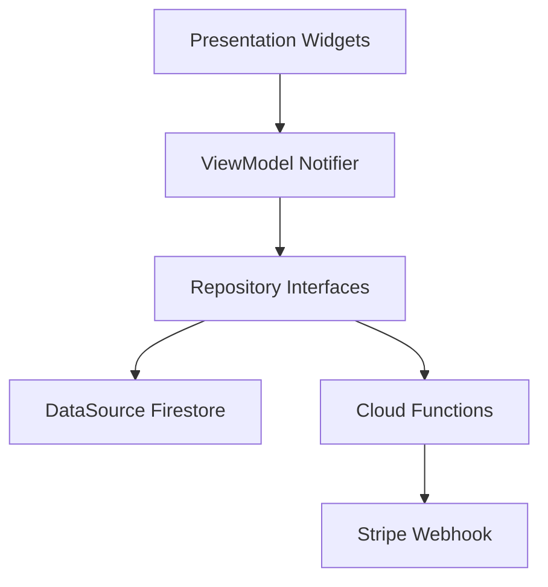
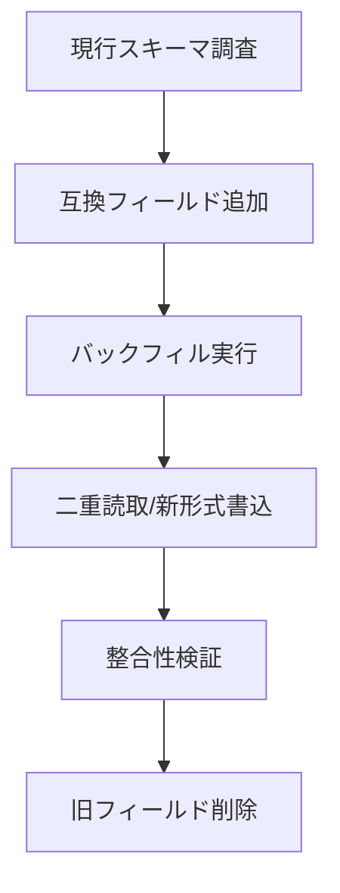

# 技術設計（Data Management Documentation）

## Overview

本仕様は、既存のデータ管理機能を体系化して文書化するための設計を定義する。対象は Firestore を中心としたデータモデリングとアクセスレイヤ（Repository/DataSource）、クエリ・インデックス戦略、整合性・同時実行制御、エラーハンドリング、性能/コスト最適化、セキュリティ整合、移行、可観測性、テスト容易性である。成果物は、以降の保守・拡張における単一の参照点となる。

### Goals

- 既存の挙動を網羅的に可視化し、変更影響を予測可能にする
- 層責務（Presentation/Domain/Repository/DataSource）を明確化し、再利用性とテスト容易性を高める
- コスト最適化とパフォーマンス維持のガイドラインを提供する

### Non-Goals

- 実装コードの提示（本設計は契約と構造に限定）
- 新規データストアの導入（Firestore を前提）

## Architecture

### 既存アーキテクチャ概要

- パターン: MVVM + Repository、Riverpod（Generator）、Freezed、GoRouter
- データ層: Repository（Domain 契約）→ DataSource（Firestore/Functions/Stripe 等）
- リアルタイム: 継続更新箇所は Stream を優先、単発取得は Future

### ハイレベル構成図（Mermaid）



### 技術整合

- 既存の命名/層分離/生成方針（`@riverpod`, Freezed, GoRouter）に整合
- Firestore/Storage ルールと Repository 事前条件の整合を必須化

## Components and Interfaces

### Domain/Repository 層

#### ProductRepository

- Primary Responsibility: 商品データの取得/更新/検索
- Domain Boundary: 商品/在庫
- Data Ownership: `products`, `inventory_counters`
- Transaction Boundary: 在庫カウンタ更新はトランザクション

Dependencies

- Outbound: ProductDataSource, InventoryCounterDataSource
- External: Firestore SDK

Contract（Service Interface 例）

```typescript
interface ProductRepository {
  watchProductsByEvent(eventId: string): Stream<List<Product>>
  fetchProduct(productId: string): Future<Product?>
  searchProducts(
    eventId: string,
    query: ProductQuery
  ): Future<Paginated<Product>>
  updateStockTransactional(productId: string, delta: number): Future<void>
}
```

Preconditions

- eventId は有効なイベントである
- delta は在庫下限を下回らない

Postconditions

- 在庫更新は原子的に反映される

#### OrderRepository

- Primary Responsibility: 注文作成/取得/履歴
- Data Ownership: `orders`, `order_items`
- Transaction Boundary: 作成時の在庫確保と整合

Contract（Service Interface 例）

```typescript
interface OrderRepository {
  createOrder(input: CreateOrderInput): Future<OrderId>
  fetchOrder(orderId: string): Future<Order?>
  watchOrdersByUser(userId: string): Stream<List<Order>>
}
```

### DataSource 層

#### ProductDataSource (Firestore)

- Collections: `products`
- Queries: `where eventId`, `orderBy createdAt`, `limit`, `startAfter`
- Indexes: `eventId+createdAt`（複合）

#### InventoryCounterDataSource (Firestore)

- Collections: `inventory_counters`
- Operation: 在庫差分のトランザクション更新（`FieldValue.increment`）

#### OrderDataSource (Firestore)

- Collections: `orders`, `order_items`
- Transaction: 注文作成 + 在庫確保の一貫性

## Data Models

### 物理モデル（Firestore）

- products: { id, eventId, title, price, tags, stock, createdAt, updatedAt }
- inventory_counters: { itemId, stock }
- orders: { id, userId, status, total, createdAt }
- order_items: { orderId, itemId, quantity, unitPrice }

インデックス

- products: `eventId asc, createdAt desc`
- orders: `userId asc, createdAt desc`

## Error Handling

- DataSource で FirebaseException → AppException(category, code) へ変換
- Repository で意味付けして伝播（ユーザ向け文言は ViewModel 層で最終整形）
- 冪等性: バッチ/トランザクションはリトライ安全を検討

## Security Considerations

- 最小権限ルール: 読み取りはイベント/ユーザーにスコープ、書込は所有/ロール条件
- サーバ専用処理は Functions（Admin）経由、秘密鍵はクライアント非露出

## Performance & Scalability

- 選択取得（必要フィールドのみ）、limit + startAfter でページング
- 高頻度書込はバッチ/トランザクション、UI 側でデバウンス
- 集計は可能な限り事前計算または Functions で集約

## Migration Strategy



- バージョンフィールド付与、段階リリース、ホットパーティション回避

## Testing Strategy

- Unit: Repository の成功/失敗経路、例外マッピング
- Integration: 複合インデックス前提のクエリ、注文作成トランザクション
- E2E: 代表的な一覧/詳細/注文フロー（必要に応じて）
- Emulator: Firestore エミュレータで再現、索引設定をテストに同梱

## Requirements Traceability（要約）

- 要件 1: Data Models → Data Models 節、Freezed 反映
- 要件 3: Query/Index → DataSource 節, インデックス定義
- 要件 4: Stream/Future → Repository 契約
- 要件 6: AppException → Error Handling 節
- 要件 8: 移行 → Migration Strategy 節

---

この設計は現行方針（`.kiro/steering/*`）に整合し、今後の拡張時は本ドキュメントを単一の参照点として更新する。
