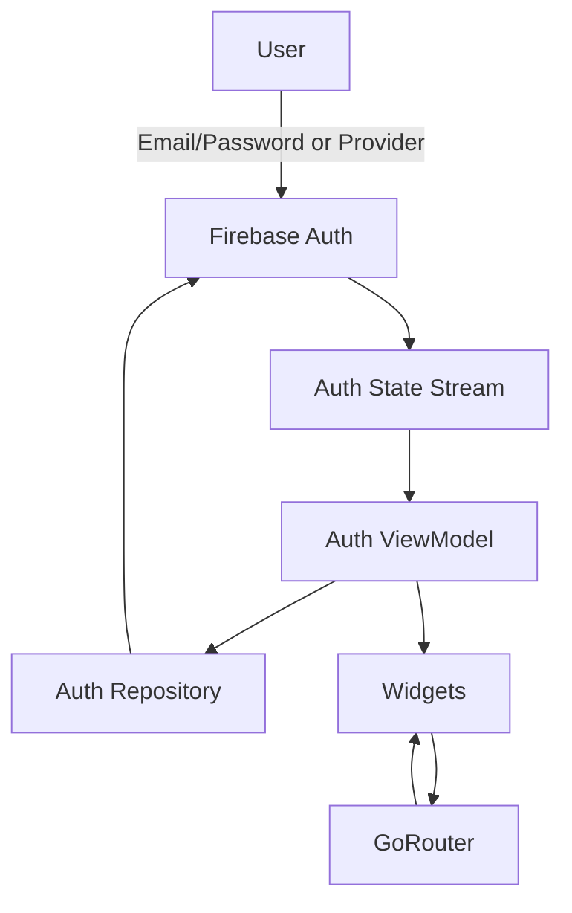
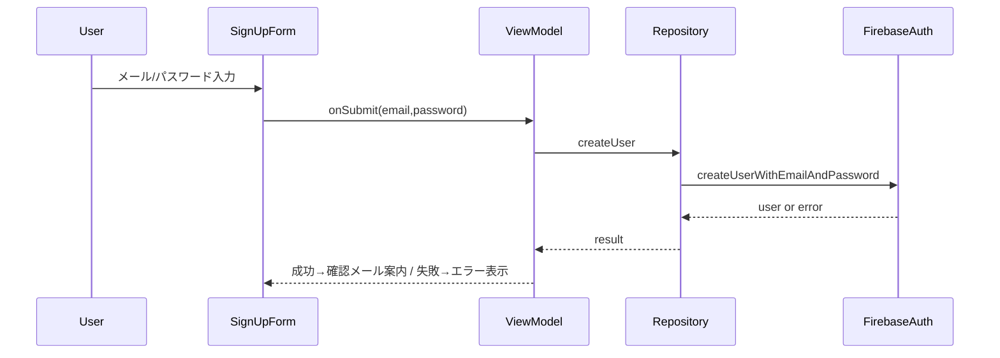
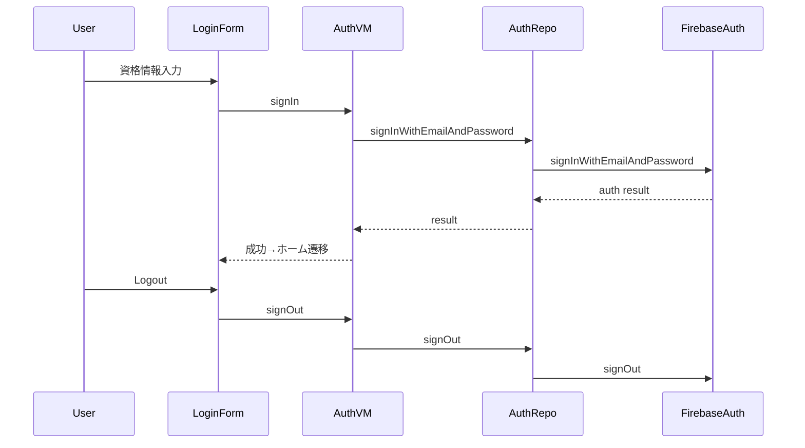
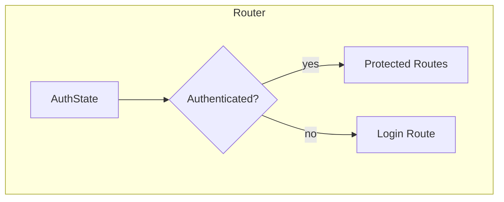

# 技術設計 — ユーザー認証ドキュメント化（既存機能）

## 概要

本設計は TLINY の既存認証機能（メール/パスワード登録・ログイン/ログアウト・任意のソーシャルサインイン・認可とルーティング・エラー処理・セキュリティ統制）を、ステアリングに整合させて明文化する。

### 目的

- 既存の認証機能の技術的境界と振る舞いを明確化し、検証可能にする
- 要件をコンポーネントとフローにマッピングし、テスト容易性を高める
- アーキテクチャ（MVVM+Repository、Riverpod、GoRouter、Firebase Auth）との整合を維持する

### 非対象

- 新規 IdP 追加やバックエンド方式の変更
- 支払い/在庫など他ドメインの仕様変更

## アーキテクチャ

### 既存構成の分析

- フロント: Flutter Web（MVVM+Repository、Riverpod Generator、Freezed、GoRouter）
- 認証基盤: Firebase Authentication（クライアント SDK）
- 状態: Riverpod プロバイダで認証状態を公開、UI が購読
- ルーティング: GoRouter の redirect で保護ルートを制御

### 高レベル構成

### 技術整合と主要決定

- 決定: 認証は Firebase Auth クライアント SDK を使用
  - 代替案: 独自バックエンド/プロキシ → 複雑性/運用コスト増
  - トレードオフ: ベンダーロックイン/SDK 制約
- 決定: ルート保護は GoRouter の redirect と認証プロバイダで集中管理
  - 代替案: 各 Widget 内で個別ガード → 重複/逸脱の温床

## システムフロー

### ユーザー登録（メール/パスワード）

### ログイン/ログアウトとセッション

### 認可とルーティング

## コンポーネントとインターフェース

### Presentation（Widget）

- LoginForm / SignUpForm / ProtectedScaffold ラッパ
- GoRouter: 認証状態を参照する redirect を設定（名前付きルート使用）

### ViewModel（Riverpod Notifier/AsyncNotifier）

- 役割: フォーム送信を受け、Repository を呼び出し、AsyncValue を公開
- 入力: ユーザー入力/操作
- 出力: 表示状態/ナビゲーション意図/ドメイン例外

### Repository

- 役割: FirebaseAuth をラップし、外部例外を AppException（ドメイン）に変換
- 主な操作（概念）: createUser, signIn, signOut, sendEmailVerification, currentUserStream

### DataSource（Firebase Auth）

- API: createUserWithEmailAndPassword, signInWithEmailAndPassword, signOut, onAuthStateChanged, sendEmailVerification

## エラーハンドリング

- 戦略: Firebase 例外 → AppException（入力/ビジネス/システム）に正規化
- UI: 重複メール/弱パス/ネットワーク等に応じた文言を一貫表示。メール未確認や MFA が必要な場合は手順提示
- 監視: クライアントログ +（必要なら）Crashlytics。Functions 側はログカテゴリで集約

## テスト戦略

- Unit: Repository のエラー変換、ViewModel の成功/失敗パス
- Integration: サインアップ → ログイン、ルーター redirect、ネットワーク障害時の挙動
- E2E/UI: 登録フロー、無効メール、弱パス、重複メール、ログアウト

## セキュリティ考慮

- HTTPS 強制、機密鍵はクライアントに置かない
- 連続失敗時のレートリミット/追加確認（将来的な拡張余地として）

## マイグレーション方針

- 本ドキュメントは既存の明文化。将来のリファクタ時はルーティングとプロバイダ連携を更新

