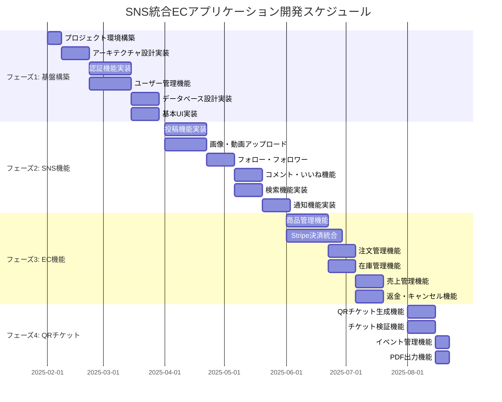

# SNS 統合 EC アプリケーション プロジェクト計画書

ドキュメントバージョン: 1.0  
作成日: 2025 年 1 月 21 日  
更新日: 2025 年 1 月 21 日

## 目次

1. [プロジェクト概要](#1-プロジェクト概要)
2. [開発フェーズ](#2-開発フェーズ)
3. [スケジュール](#3-スケジュール)
4. [リソース配分](#4-リソース配分)
5. [リスク管理](#5-リスク管理)
6. [品質管理](#6-品質管理)
7. [コミュニケーション](#7-コミュニケーション)

---

## 1. プロジェクト概要

### 1.1 プロジェクト目標

- **主要目標**: SNS機能とEC機能を統合したモバイルアプリケーションの開発
- **期間**: 2025年2月1日 ～ 2025年8月31日（7ヶ月）
- **予算**: 5,000万円
- **チーム規模**: 8名

### 1.2 成功指標

| 指標 | 目標値 | 測定方法 |
|------|--------|----------|
| **開発完了率** | 100% | 機能実装完了 |
| **品質指標** | バグ率 < 2% | テスト結果 |
| **スケジュール遵守** | 95% | マイルストーン達成 |
| **予算遵守** | 100% | コスト管理 |

---

## 2. 開発フェーズ

### 2.1 フェーズ1: 基盤構築（2ヶ月）

#### 2.1.1 期間
- **開始**: 2025年2月1日
- **終了**: 2025年3月31日

#### 2.1.2 主要タスク

| タスク | 担当 | 期間 | 優先度 |
|--------|------|------|--------|
| **プロジェクト環境構築** | 全員 | 1週間 | 高 |
| **アーキテクチャ設計実装** | アーキテクト | 2週間 | 高 |
| **認証機能実装** | バックエンド | 3週間 | 高 |
| **ユーザー管理機能** | フロントエンド | 3週間 | 高 |
| **データベース設計実装** | バックエンド | 2週間 | 高 |
| **基本UI実装** | フロントエンド | 2週間 | 中 |

#### 2.1.3 成果物
- プロジェクト基盤
- 認証システム
- ユーザー管理機能
- 基本UIコンポーネント

### 2.2 フェーズ2: SNS機能開発（2ヶ月）

#### 2.2.1 期間
- **開始**: 2025年4月1日
- **終了**: 2025年5月31日

#### 2.2.2 主要タスク

| タスク | 担当 | 期間 | 優先度 |
|--------|------|------|--------|
| **投稿機能実装** | フロントエンド | 3週間 | 高 |
| **画像・動画アップロード** | バックエンド | 3週間 | 高 |
| **フォロー・フォロワー機能** | フロントエンド | 2週間 | 高 |
| **コメント・いいね機能** | フロントエンド | 2週間 | 中 |
| **検索機能実装** | バックエンド | 2週間 | 中 |
| **通知機能実装** | バックエンド | 2週間 | 中 |

#### 2.2.3 成果物
- SNS機能一式
- メディアアップロード機能
- 検索・通知システム

### 2.3 フェーズ3: EC機能開発（2ヶ月）

#### 2.3.1 期間
- **開始**: 2025年6月1日
- **終了**: 2025年7月31日

#### 2.3.2 主要タスク

| タスク | 担当 | 期間 | 優先度 |
|--------|------|------|--------|
| **商品管理機能** | フロントエンド | 3週間 | 高 |
| **Stripe決済統合** | バックエンド | 4週間 | 高 |
| **注文管理機能** | フロントエンド | 2週間 | 高 |
| **在庫管理機能** | バックエンド | 2週間 | 中 |
| **売上管理機能** | フロントエンド | 2週間 | 中 |
| **返金・キャンセル機能** | バックエンド | 2週間 | 中 |

#### 2.3.3 成果物
- EC機能一式
- 決済システム
- 在庫・売上管理

### 2.4 フェーズ4: QRチケット機能（1ヶ月）

#### 2.4.1 期間
- **開始**: 2025年8月1日
- **終了**: 2025年8月31日

#### 2.4.2 主要タスク

| タスク | 担当 | 期間 | 優先度 |
|--------|------|------|--------|
| **QRチケット生成機能** | バックエンド | 2週間 | 高 |
| **チケット検証機能** | フロントエンド | 2週間 | 高 |
| **イベント管理機能** | フロントエンド | 1週間 | 中 |
| **PDF出力機能** | バックエンド | 1週間 | 中 |

#### 2.4.3 成果物
- QRチケットシステム
- イベント管理機能

---

## 3. スケジュール

### 3.1 全体スケジュール



### 3.2 マイルストーン

| マイルストーン | 日付 | 成果物 |
|----------------|------|--------|
| **M1: 基盤完成** | 2025年3月31日 | 認証・ユーザー管理機能 |
| **M2: SNS機能完成** | 2025年5月31日 | SNS機能一式 |
| **M3: EC機能完成** | 2025年7月31日 | EC機能一式 |
| **M4: 全体完成** | 2025年8月31日 | 全機能完成 |

---

## 4. リソース配分

### 4.1 チーム構成

| 役割 | 人数 | 担当領域 |
|------|------|----------|
| **プロジェクトマネージャー** | 1名 | プロジェクト管理・調整 |
| **アーキテクト** | 1名 | システム設計・技術選定 |
| **フロントエンド開発者** | 3名 | Flutter UI開発 |
| **バックエンド開発者** | 2名 | Firebase・API開発 |
| **QAエンジニア** | 1名 | テスト・品質保証 |

### 4.2 スキル要件

#### 4.2.1 フロントエンド開発者
- **必須スキル**
  - Flutter 3.x
  - Dart
  - Riverpod
  - Material Design 3
- **推奨スキル**
  - Firebase
  - Stripe API
  - モバイルアプリ開発経験

#### 4.2.2 バックエンド開発者
- **必須スキル**
  - Firebase (Firestore, Auth, Functions)
  - TypeScript/JavaScript
  - Stripe API
- **推奨スキル**
  - Cloud Functions
  - Algolia
  - 決済システム開発経験

#### 4.2.3 QAエンジニア
- **必須スキル**
  - Flutterテスト
  - 自動化テスト
  - 手動テスト
- **推奨スキル**
  - Firebase Test Lab
  - パフォーマンステスト
  - セキュリティテスト

### 4.3 予算配分

| 項目 | 予算 | 割合 |
|------|------|------|
| **人件費** | 3,500万円 | 70% |
| **インフラ費用** | 500万円 | 10% |
| **外部サービス** | 800万円 | 16% |
| **その他** | 200万円 | 4% |

#### 4.3.1 外部サービス費用内訳
- **Firebase**: 200万円/年
- **Stripe**: 100万円/年
- **Algolia**: 50万円/年
- **その他**: 450万円

---

## 5. リスク管理

### 5.1 技術リスク

| リスク | 影響度 | 発生確率 | 対策 |
|--------|--------|----------|------|
| **Firebase制限** | 高 | 中 | 早期テスト・代替案検討 |
| **Stripe統合問題** | 高 | 低 | 段階的統合・テスト環境 |
| **パフォーマンス問題** | 中 | 中 | 早期プロトタイプ・監視 |
| **セキュリティ脆弱性** | 高 | 低 | 定期的セキュリティ監査 |

### 5.2 スケジュールリスク

| リスク | 影響度 | 発生確率 | 対策 |
|--------|--------|----------|------|
| **開発遅延** | 高 | 中 | バッファ時間確保・並行開発 |
| **要件変更** | 中 | 中 | 変更管理プロセス |
| **リソース不足** | 高 | 低 | 外部リソース確保 |

### 5.3 リスク対応計画

```dart
// lib/core/risk/risk_manager.dart
class RiskManager {
  // リスク監視
  void monitorRisks() {
    // 定期的なリスク評価
    Timer.periodic(Duration(days: 7), (timer) {
      _assessRisks();
    });
  }
  
  void _assessRisks() {
    // 技術リスクの評価
    _assessTechnicalRisks();
    
    // スケジュールリスクの評価
    _assessScheduleRisks();
    
    // リスクレポートの生成
    _generateRiskReport();
  }
  
  void _assessTechnicalRisks() {
    // パフォーマンス監視
    final performanceMetrics = _getPerformanceMetrics();
    if (performanceMetrics.isBelowThreshold) {
      _triggerPerformanceOptimization();
    }
    
    // セキュリティ監査
    final securityScan = _runSecurityScan();
    if (securityScan.hasVulnerabilities) {
      _triggerSecurityFix();
    }
  }
}
```

---

## 6. 品質管理

### 6.1 品質指標

| 指標 | 目標値 | 測定頻度 |
|------|--------|----------|
| **コードカバレッジ** | 80%以上 | 毎週 |
| **バグ密度** | 2件/1000行以下 | 毎週 |
| **ビルド成功率** | 95%以上 | 毎日 |
| **テスト成功率** | 95%以上 | 毎日 |

### 6.2 品質保証プロセス

#### 6.2.1 コードレビュー
- **必須レビュー**: 全コード
- **レビュー担当**: シニア開発者
- **レビュー項目**: 機能・性能・セキュリティ・可読性

#### 6.2.2 テスト戦略
- **単体テスト**: 全機能
- **統合テスト**: 主要機能
- **E2Eテスト**: 重要フロー
- **パフォーマンステスト**: 定期的実行

#### 6.2.3 品質ゲート
```dart
// lib/core/quality/quality_gate.dart
class QualityGate {
  static Future<bool> checkQualityGate() async {
    // コードカバレッジチェック
    final coverage = await _getCodeCoverage();
    if (coverage < 80) {
      print('Quality Gate Failed: Code coverage below 80%');
      return false;
    }
    
    // バグ数チェック
    final bugCount = await _getBugCount();
    if (bugCount > 10) {
      print('Quality Gate Failed: Too many bugs');
      return false;
    }
    
    // ビルド成功チェック
    final buildSuccess = await _checkBuildSuccess();
    if (!buildSuccess) {
      print('Quality Gate Failed: Build failed');
      return false;
    }
    
    return true;
  }
}
```

---

## 7. コミュニケーション

### 7.1 会議スケジュール

| 会議 | 頻度 | 参加者 | 目的 |
|------|------|--------|------|
| **デイリースタンドアップ** | 毎日 | 全員 | 進捗確認・課題共有 |
| **週次レビュー** | 毎週金曜 | 全員 | 週次進捗・次週計画 |
| **スプリントレビュー** | 2週間ごと | 全員 | 機能デモ・フィードバック |
| **ステークホルダーミーティング** | 月1回 | PM・ステークホルダー | 全体進捗・課題確認 |

### 7.2 コミュニケーションツール

| ツール | 用途 | 使用頻度 |
|--------|------|----------|
| **Slack** | 日常コミュニケーション | 毎日 |
| **Zoom** | オンライン会議 | 毎日 |
| **GitHub** | コード管理・レビュー | 毎日 |
| **Notion** | ドキュメント管理 | 毎日 |
| **Jira** | タスク管理 | 毎日 |

### 7.3 報告体制

#### 7.3.1 日次報告
- **対象**: プロジェクトマネージャー
- **内容**: 進捗・課題・次日の予定
- **方法**: Slack・メール

#### 7.3.2 週次報告
- **対象**: ステークホルダー
- **内容**: 週次進捗・課題・リスク
- **方法**: 会議・レポート

#### 7.3.3 月次報告
- **対象**: 経営陣
- **内容**: 全体進捗・予算・品質
- **方法**: プレゼンテーション

---

## まとめ

このプロジェクト計画書は、SNS統合ECアプリケーションの開発を成功に導くための包括的な計画を定義しています。各フェーズでの具体的なタスク、スケジュール、リソース配分を明確にし、リスク管理と品質保証の仕組みを確立しています。

計画に従って開発を進め、定期的なレビューと調整を行い、プロジェクトの成功を目指してください。